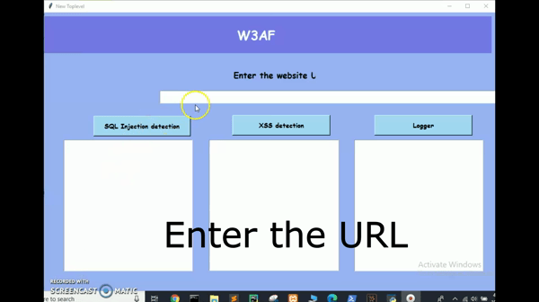
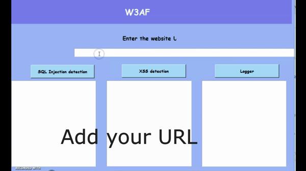
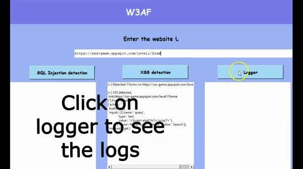

# CSS-Assignment-W3AF
The experimental setup makes use of  w3af and uses the URL of the website to detect SQL Injection and XSS. Apart from that, it also keeps a track of all the URL’s, the outputs and even the time and date of the operation. 
This application uses Python to develop w3af along with libraries such as urllib which is the URL handling module, requestlib allows sending HTTP requests extremely easily and tkinter is a Python binding to the Tk GUI toolkit. 

The application works in the following way:

1. Enter the URL of the target website:
Once the application is started, the user must paste the link of the URL of the target website in the box provided. Vulnerabilities will be check for the URL provided.

2. Checking Vulnerabilities for the target website
SQL Injection
Once the website link has been entered, the possibility of SQL injection can be checked by clicking on the SQL Injection detection box. 
This will run the code for the particular page of the provided website and report if any possible vulnerabilities present.
It will also return the location and function where a possibility of attack is detected
if no possibility of vulnerabilities are detected it will return No SQL Injection detected

Cross Site Scripting
Once the website link has been entered, the possibility of Cross Site Scripting can be checked by clicking on the XSS box. 
This will run the code for the particular page of the provided website and report if any possible vulnerabilities present.
It will also return the location and function where a possibility of attack is detected
If no possibility of vulnerabilities are detected it will return XSS vulnerability not found

3. Logger 	
Logger keeps a track of all the activities performed by the user. 
It keeps track of the URL entered, type of vulnerability tested, presence or absence of the vulnerability, the output of the performed action, Location and function of the threat detected and date and time of the operation.

